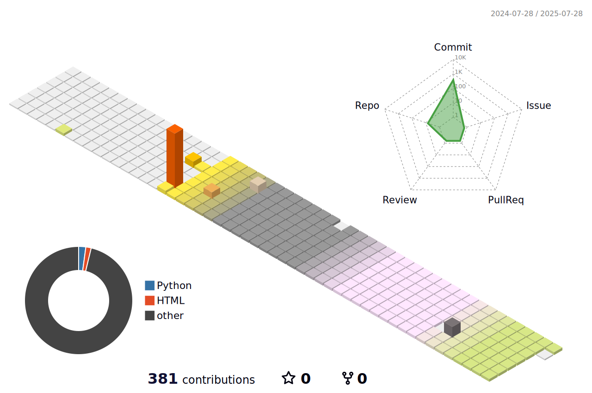

    

# 📌 About Me

   
🎓 College of Art & Technology, Chung-Ang University      ☎️010-3070-8687      📧 lindalje@daum.net
    

  
# 💻 Tech Stack 💻
 

 

 

    

# 📊 GitHub Stats 📊
 

    

    
# 🏆 GitHub Trophies 🏆
    

    

