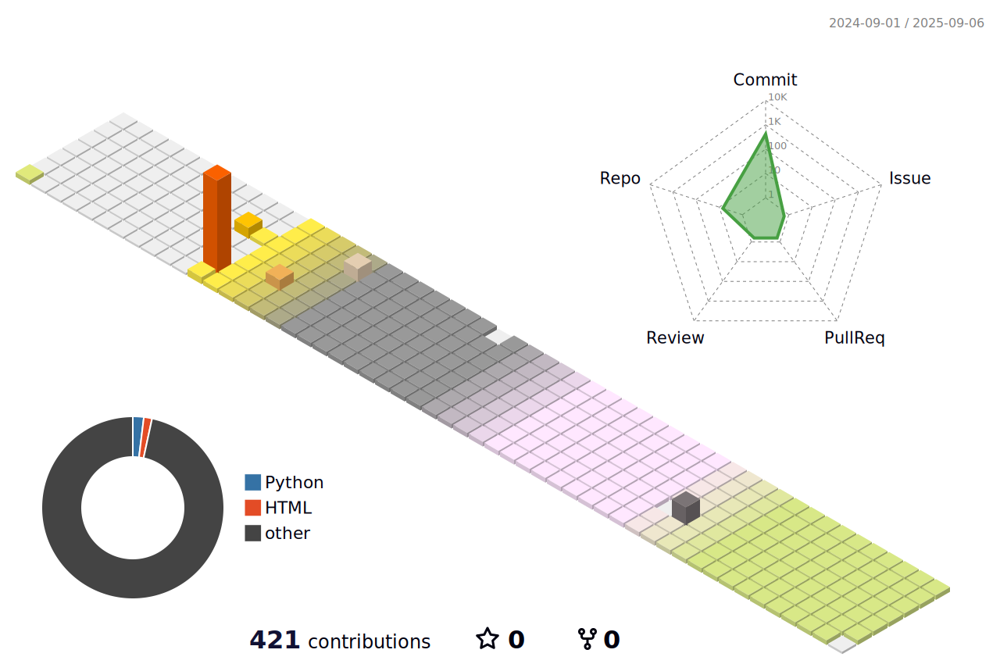

    

# 📌 About Me
   
📠College of Art & Technology, Chung-Ang University      â˜ï¸010-3070-8687      📧 lindalje@daum.net
    

  
# 💻 Tech Stack 💻
    

         
    
#
    

    

# 📊 GitHub Stats 📊
 
 

    
# 🏆 GitHub Trophies 🏆
    

    

